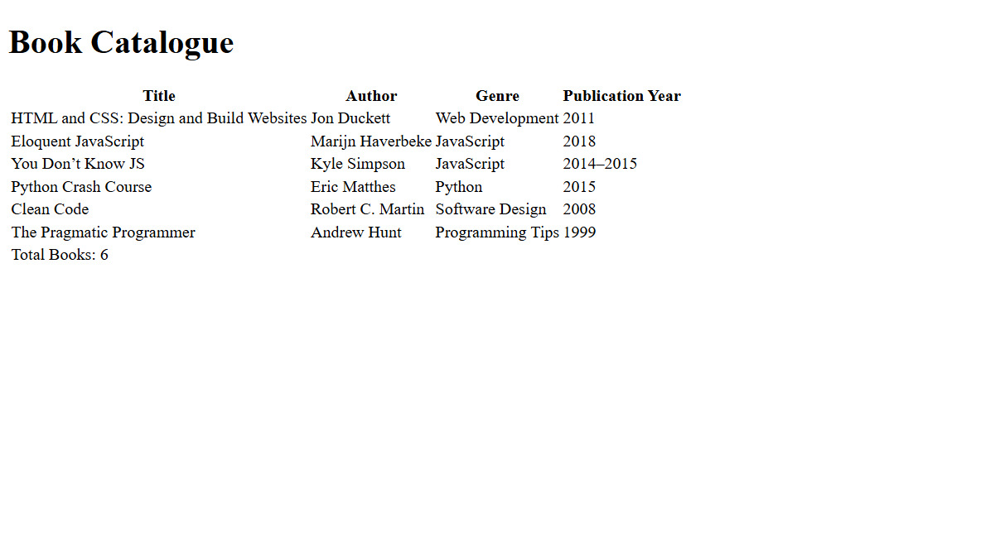

# 📚 Book Catalogue – HTML Tables Project

## 🧾 What This Project Covers
This project focuses on building a book catalogue using HTML tables. It helps in understanding how to display structured data using the `<table>`, `<thead>`, `<tbody>`, `<tr>`, `<th>`, and `<td>` elements.

## 🎯 Purpose
The goal is to practice the usage of HTML tables by creating a catalog of popular coding books, displaying key information such as title, author, genre, and publication year.

## 🛠 Tools Used
- HTML5

## 📸 Screenshot

## 🌐 Live Demo
[View Live Project](https://codewithsam025.github.io/book-catalogue-page/)
